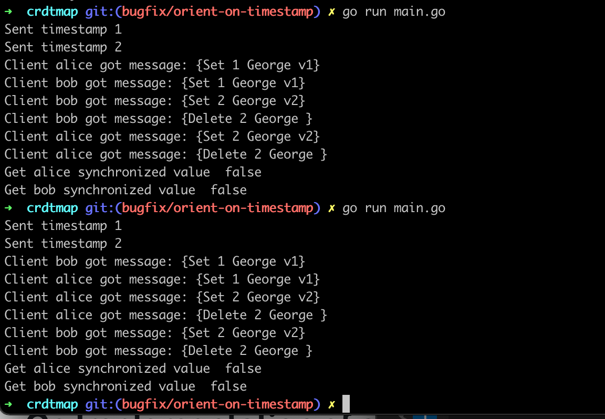

# Go Implementation of a CRDT Map

This is a go implementation of a broken CRDT algorithm instigated by [Martin Kleppmann](https://twitter.com/martinkl/status/1327025979454263297).

# Running

```
$ go run main.go
```

# Tests
```
$ go test -count 1000
```


# Example



